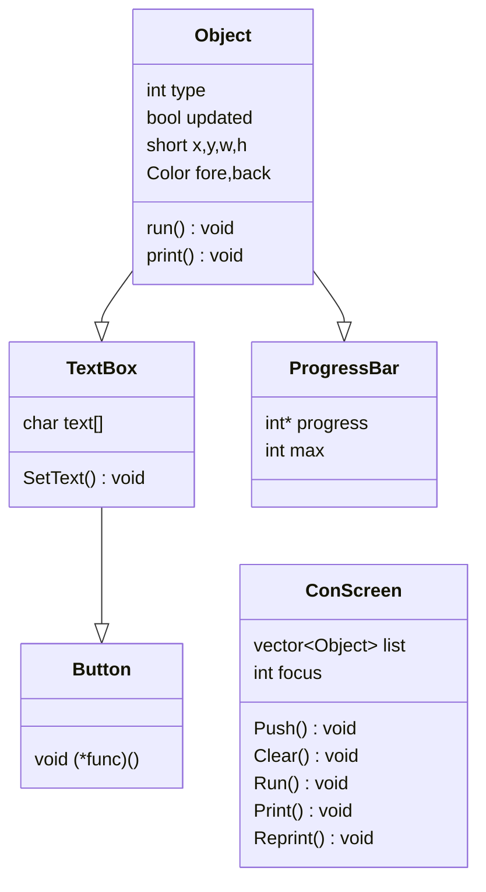

```mermaid
classDiagram
	direction BT
	class Object{
		int type
		bool updated
		short x,y,w,h
		Color fore,back
		run() void
		print() void
	}
	class TextBox{
		char text[]
		SetText() void
	}
	TextBox <|-- Object
	class Button{
		void (*func)()
	}
	Button <|-- TextBox
	class ProgressBar{
		int* progress
		int max
	}
	ProgressBar <|-- Object
	class ConScreen{
		vector~Object~ list
		int focus
		Push() void
		Clear() void
		Run() void
		Print() void
		Reprint() void
	}
```